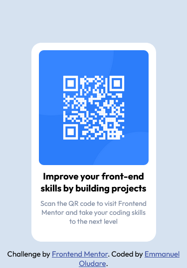

# Frontend Mentor - QR code component solution

This is a solution to the [QR code component challenge on Frontend Mentor](https://www.frontendmentor.io/challenges/qr-code-component-iux_sIO_H). Frontend Mentor challenges help you improve your coding skills by building realistic projects. 

## Table of contents

- [Overview](#overview)
  - [Screenshot](#screenshot)
  - [Links](#links)
- [My process](#my-process)
  - [Built with](#built-with)
  - [What I learned](#what-i-learned)
  - [Continued development](#continued-development)
- [Author](#author)
- [Acknowledgments](#acknowledgments)


## Overview

### Screenshot




### Links

- Solution URL: [Solution URL](https://www.frontendmentor.io/solutions/qrcodecomponent-r1yyLGiLc)
- Live Site URL: [Live Site URL](https://qr-code-component-react.netlify.app/)

## My process

### Built with

- CSS custom properties
- Flexbox
- Mobile-first workflow
- [React](https://reactjs.org/) - JS library

### What I learned

This is actually my first project using React and i must say 'I LOVE IT!!!' it's very much easier and enhances higher productivity,I encountered some difficulties but finally solved it, which I'm glad i did.

```js
function App() {
  return (
    <div className="app">
      <Card />
      <Footer />
    </div>
  );
}
```

### Continued development

I would definitely continue using React but i would need to step up my game so i can write better code.I actually believe my file structure is unconventional but i will try to improve that in the nearest future.

## Author
- Frontend Mentor - [@Michaelhybrid](https://www.frontendmentor.io/profile/Michaelhybrid)
- Twitter - [@micheal_olu99](https://twitter.com/micheal_olu99)

## Acknowledgments
To God be the glory.
